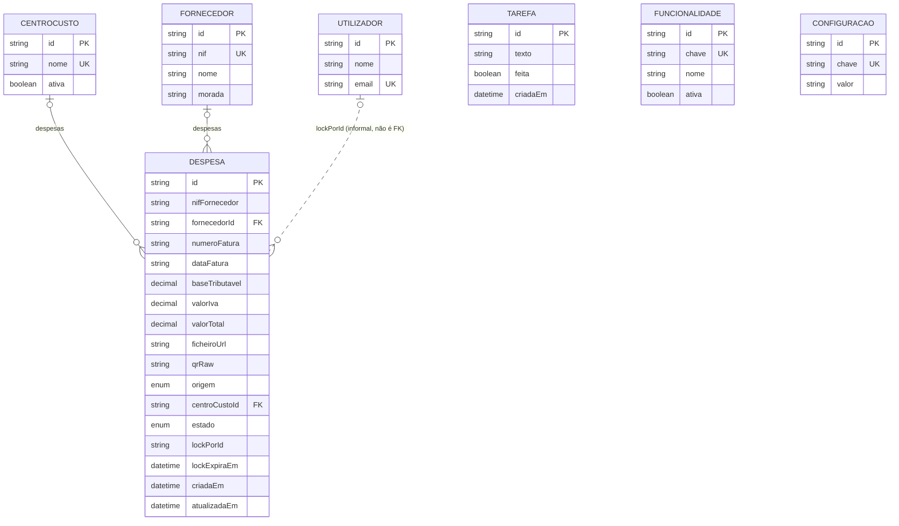

# Diagrama de entidades e relacionamentos

Gerado a partir de `server/prisma/schema.prisma`. Atualizar este ficheiro sempre
que o schema mudar.

## Notas

- **CentroCusto ↔ Despesa** e **Fornecedor ↔ Despesa** são opcionais dos dois
  lados: uma despesa pode chegar sem centro de custo atribuído (`POR_REVER`)
  ou sem fornecedor resolvido; `onDelete: Restrict` em ambas impede apagar um
  CentroCusto ou Fornecedor enquanto houver despesas associadas.
- **`CentroCusto`** é o antigo `Obra` generalizado (CLAUDE.md #10) — o nome
  interno já não está preso a este cliente. O rótulo mostrado na UI
  ("Obra"/"Obras" por defeito) é configurável em Definições e vive em
  `Configuracao`, não no schema.
- **`Configuracao`** é um par chave/valor livre (mesmo padrão de
  `Funcionalidade`: chave definida em código, semeada no arranque). Hoje só
  guarda o rótulo singular/plural do CentroCusto; é independente do resto do
  modelo.
- **Chave de deduplicação** (CLAUDE.md #2): `@@unique([nifFornecedor,
  numeroFatura, dataFatura])` em `Despesa` — é o que impede duplicar a mesma
  fatura chegada por foto e por email.
- **`lockPorId`** não é uma foreign key formal no schema (é só `String?`), mas
  aponta semanticamente para `Utilizador.id` — usado no bloqueio de revisão
  com TTL de 5 min (CLAUDE.md #3).
- **`Tarefa`** e **`Funcionalidade`** são entidades independentes, sem
  relação com o resto do modelo.
- **Enums**: `EstadoDespesa` (`POR_REVER` / `CONFIRMADA` / `ADIADA`) e
  `OrigemDespesa` (`UPLOAD` / `EMAIL`).
- **Dinheiro** (`baseTributavel`, `valorIva`, `valorTotal`) é sempre
  `Decimal(12,2)`, nunca float (CLAUDE.md #1).
